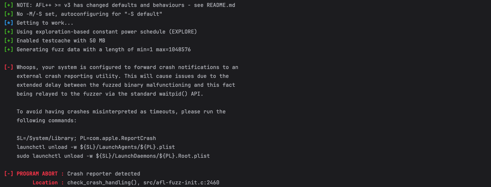
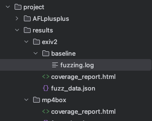

# 智能模糊测试框架

## 目录
- [环境配置](#环境配置)
- [基线实现](#基线实现)
- [创新点1: 基于语义的变异策略](#创新点1-基于语义的变异策略)
- [创新点2: 神经网络种子选择](#创新点2-神经网络种子选择)
- [运行和评估](#运行和评估)

## 环境配置

### 系统要求
- Python 3.8+
- Ubuntu 20.04/MacOS/Windows WSL2

### 安装AFL++
```bash
git clone https://github.com/AFLplusplus/AFLplusplus.git
cd AFLplusplus
make
sudo make install
```

### 安装Python依赖
```bash
pip install -r requirements.txt
```

### 目录结构
```
project/
├── AFLplusplus/
├── benchmark/
│   ├── exiv2
│   ├── mp4box
│   └── objdump
├── seeds/
│   ├── exiv2/
│   ├── mp4box/
│   └── objdump/
├── baseline.py
├── semantic_fuzzer.py
└── nn_seed_fuzzer.py
```

## 基线实现

### 算法概述
基线fuzzer基于AFL++实现，主要功能包括:
- 输入种子管理
- 覆盖率统计
- 崩溃检测
- 基本变异策略

### 关键组件
```python
class FuzzFramework:
    def __init__(self):
        # 初始化AFL环境
    
    def run_afl(self):
        # 运行AFL基本模糊测试
        
    def _collect_stats(self):
        # 收集覆盖率等统计信息
```

## 创新点1: 基于语义的变异策略

### 算法原理
1. 基于启发式规则识别输入文件的关键位置:
   - 长度字段
   - 文件头
   - 分隔符
   - 结构边界

2. 针对性变异操作:
   - 比特翻转
   - 字节插入
   - 字节删除
   - 特殊值替换

### 实现细节
```python
class SemanticMutator:
    def get_mutation_points(self):
        # 识别关键变异位置
        
    def mutate(self):
        # 执行语义感知变异
```

## 创新点2: 神经网络种子选择

### 算法原理
1. 种子评估网络:
   - 输入: 种子文件字节序列
   - 输出: 种子质量得分
   - 架构: 三层前馈网络

2. 强化学习训练:
   - 奖励: 覆盖率增量
   - 经验回放缓冲
   - 批量训练更新

### 网络结构
```python
class SeedEvaluator(nn.Module):
    def __init__(self):
        self.network = nn.Sequential(
            nn.Linear(256, 128),
            nn.ReLU(),
            nn.Linear(128, 64),
            nn.ReLU(),
            nn.Linear(64, 1)
        )
```

## 运行和评估

### 运行测试
```bash
# 基线测试
python baseline.py

# 语义变异测试
python semantic_fuzzer.py

# 神经网络种子选择测试
python nn_seed_fuzzer.py
```

### 结果分析
- comparison_report.html: 覆盖率对比可视化
- comparison_data.json: 详细统计数据

### 测试程序准备
1. 编译目标程序
```bash
cd benchmark
./build.sh
```

2. 准备种子文件
```bash
cd seeds
./collect_seeds.sh
```

### 性能评估指标
1. 代码覆盖率
   - 边覆盖率
   - 路径总数
   
2. 漏洞发现能力
   - 崩溃数量
   - 独特崩溃数

3. 效率
   - 执行速度
   - 内存使用


